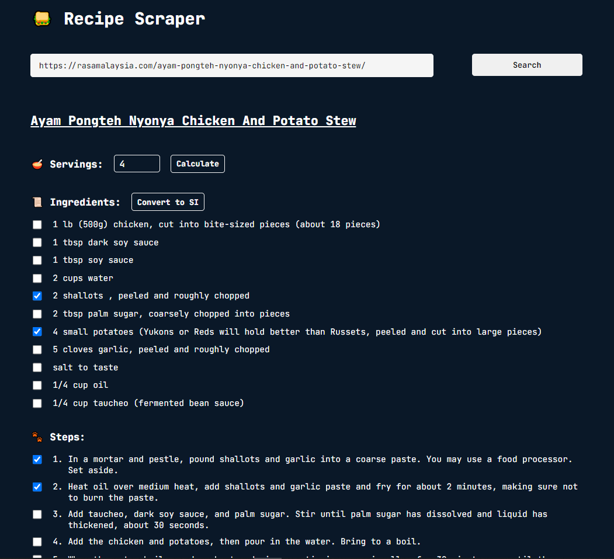
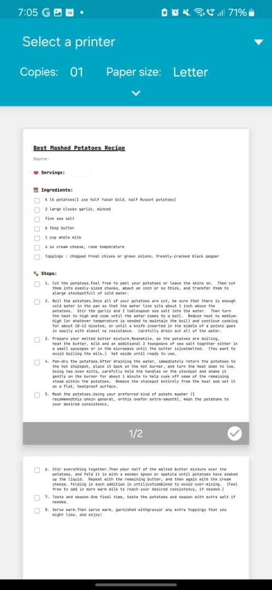
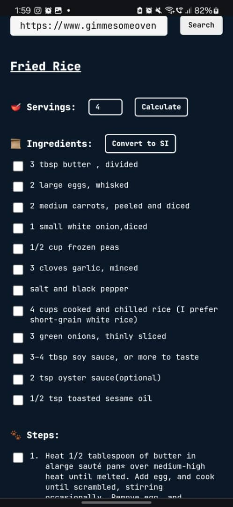

# Vue.js Frontend for the Recipe Scraper Web App

## View at:
https://recipescraper.mintchococookies.com

## Key Features
- Retrieve ingredients list and cooking instructions from any recipe URL.
- Dynamically adjust servings for accurate ingredient quantities.
- Convert units between SI and metric systems.
- Save recipes as PDFs or print them directly from the page.
- Clean and intuitive user interface for easy use.

## Sample websites to test
- https://rasamalaysia.com/ayam-pongteh-nyonya-chicken-and-potato-stew/
- https://www.gimmesomeoven.com/best-mashed-potatoes-recipe/
- https://www.simplyrecipes.com/recipes/spaghetti_alla_carbonara/

## Disclaimer
This is my personal project as a junior software engineer and may not meet production-level reliability standards. While I have made every effort to accommodate various website layouts, the diversity of web content means that some recipes may not display optimally in this application. As I continue to develop my skills, I am actively working to improve the consistency and accuracy of recipe retrieval and formatting. 🚀💪

#### Some scenarios I'm working to improve accuracy on:
- Recipe/ingredients are sometimes repeated in different sections on some websites.
- Lack of semantic labeling (eg. having id or class names with the word "ingredients" etc) for required sections on some websites. I've implemented manual DOM traversal searching based on what could be the beginning and ending of the ingredients/directions sections, but it's not 100% accurate at the moment.
- Complex nesting of divs on some websites makes it challenging to extract sections. For example, see the ingredients UI design at https://www.sidechef.com/recipes/6106/chicken_chop_with_black_pepper_sauce/, which uses many nested divs.

## Snapshots

